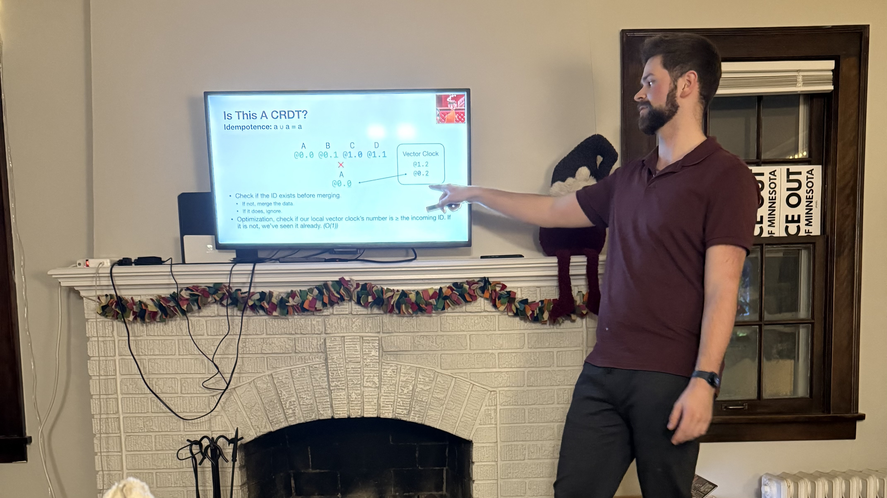

Over the last year or so I've been quietly working on a library for syncing data between user's devices, as a replacement for the existing sync algorithm in my app [OpenBudget](https://openbudget.us). This has culminated in a deep dive into CRDTs. The result of which, is a Swift data structure I call `MergableCollection`. This is a version of the YATA CRDT construction, which can handle concurrent text modifications and merge them reasonably.

I spent so much time researching text CRDTs that I ended up giving a presentation on it to my friends at our annual presentation party.

As I was consumed by researching this data structure, my friends would ask "what are you working on". I found myself saying "oh, it's like how Google Docs works" often. Now, six months after that presentation, I've wrapped up the implementation and have been interested in running Swift on WASM. While I was on vacation this past week, the thought hit me, "how hard would it be to make Google Docs in Swift?". ***KhanDocs*** was born.

This demo is pure Swift running a server on Linux and the client in my browser with WASM.

<video src="assets/khandocs.mov" controls="" autoplay></video>

