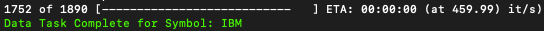
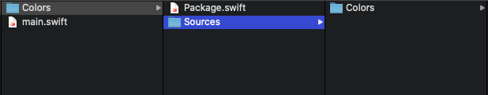
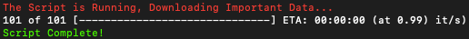

## Swift-sh

Swift-sh is an amazing dependency package from [Max Howel](https://github.com/mxcl/swift-sh). The library makes it easy to use any Swift Package Manager (SPM) package into your Swift scripts. ([more on writing Swift scripts](https://windchillblog.com/snippets/2020/05/05/scripting-with-swift))

In this example I'll be importing the [Colors library by paulot](https://github.com/paulot/Colors) and the [Progress library from jkandzi](https://github.com/jkandzi/Progress.swift) . A mixture of these two libraries makes for fun, colorful script output like this.



Which I think is fun. We'll be importing both libraries using Swift-sh.


## Install Swift-sh

To install swift-sh you'll need [homebrew](https://docs.brew.sh/Installation) installed on your mac.

Then, it's just a simple command to install

`brew install mxcl/made/swift-sh`

<small>Go check out [Max's GitHub](https://github.com/mxcl) and [Patreon](https://www.patreon.com/mxcl). He's an amazing programmer and has built tons of important open source tools</small>


## Create The Script

`cd` into the directory you'll run your script in and run `touch main.swift` to create an empty script. Then make it executable using `chmod +x main.swift`.

Now open the file using any editor and enter this on the first line.

```swift
#!/usr/bin/swift sh
```

This tells the terminal to use `swift sh` to execute our script, which is exactly what we want.


## Import Progress

Next, in the `main.swift` file do a normal import like you would in any other Swift project.

```swift 
import Foundation
import Progress
import Colors
```

If you run this code right now you'll get an error because there aren't any packages linked to your script. Let's import Progress with swift-sh like this.

```swift
import Progress // jkandzi/Progress.swift
```

The comment after the import statement tells swift-sh to retreive the SPM package Progress.swift from GitHub. You tell swift-sh where the package is by giving it the path to the repository on GitHub.


## Import Colors

Now that Progress is imported successfully lets import Colors.

Colors doesn't have SPM support naturally, so I'm going to give it one. I've downloaded the source code from here and grabbed all the files in the folder Colors. I've deleted the files `Colors.o``Info.plist` and `ANSITextColorCode.o` as the script doesn't need them.

Now go back to the directory your script is in and run `mkdir Colors`. `cd` into the new directory and run `mkdir Sources`. 

Next, drag and drop the downloaded Colors folder into the Sources folder you just made.

The last thing we need to make is a `Package.swift` file. This tells SPM what code is available for this package. Make one using `touch Package.swift`

Your file structure should look like this.



Open Package.swift and copy-paste the following into the file.

```swift
// swift-tools-version:5.1
// The swift-tools-version declares the minimum version of Swift required to build this package.

import PackageDescription

let package = Package(
    name: "Colors",
    products: [
        .library(
            name: "Colors",
            targets: ["Colors"]),
    ],
    targets: [
        .target(
            name: "Colors",
            dependencies: [])
    ]
)

```

Save it, and you now have a SPM package!

Lets go back to the `main.swift` file and import Colors using swift-sh like this.

```swift
import Colors // ./Colors/
```


## Run The Script

Now that all the dependencies are working, your script should look like this.

```swift
#!/usr/bin/swift sh

import Foundation
import Colors // ./Colors/
import Progress // jkandzi/Progress.swift
```

Add this code to give some fun output when you run the script.

```swift
#!/usr/bin/swift sh

import Foundation
import Colors // ./Colors/
import Progress // jkandzi/Progress.swift

print(Colors.Red("The Script is Running, Downloading Important Data..."))
for _ in Progress(0...100) {
    sleep(1)
}
print(Colors.Green("Script Complete!"))
```

To run the script run `./main.swift` in the same directory as the script. If you get an error saying `zsh: permission denied: ./main.swift` run `chmod +x main.swift` to fix it.


Your terminal should now be counting down from 101, nice job!



Full usage documentation for swift-sh can be found [here](https://github.com/mxcl/swift-sh#usage). I've only covered two ways of using this library but there's much more you can do with it.


