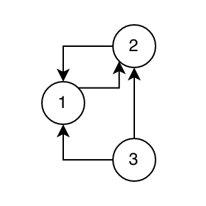
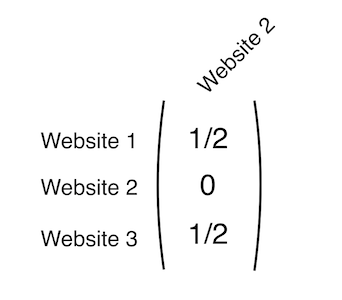

## Search engines rank pages based on how likely you are to visit them

For a person, this might be a simple thing to understand. You would probably think the search engine should probably rank websites that are more popular higher on the list. However, computers don't understand popularity inherently. We have to convert a human problem, "How popular is this website" into a math problem. How does one do that?

The answer: **Matrices**

## A bit of a primer

If you haven't taken Linear Algebra, there's a good chance you have never heard of matrices. So here's a brief explaination.

**Matrices** hold numbers in a grid, sort of like a Sudoku board. Below is a matrix called the _Identity Matrix_ You can think of it as the 1 of matrices.

$$
I=\begin{pmatrix}1&0&0\\ 0&1&0\\ 0&0&1\end{pmatrix}
$$

You can use matrices like other numbers, adding, subtracting, multiplying, dividing etc. For instance if we multiply *I* by 2 we get

$$
I\cdot 2=\begin{pmatrix}2&0&0\\ 0&2&0\\ 0&0&2\end{pmatrix}
$$

We can also put numbers in where we currently have 0 like below, as well as have different numbers of rows and columns.

$$
I_2=\begin{pmatrix}1\\ 0\\ 0\end{pmatrix},\:I_3=\begin{pmatrix}1&\frac{1}{2}&\infty \\ sin\left(\theta \right)&\pi &\log \left(20\right)\\ -1&2&\frac{3}{4}\end{pmatrix}
$$

If you multiply a narrow matrix by a wider matrix with the same number of rows, you'll end up with a narrow matrix. This will come in handy later when calculating probabilities.

$$
I_2\cdot I=\begin{pmatrix}1&0&0\\ 0&1&0\\ 0&0&1\end{pmatrix}\begin{pmatrix}1\\ 0\\ 0\end{pmatrix}=\begin{pmatrix}1\\ 0\\ 0\end{pmatrix}
$$

## Turning the _human_ problem into a _computer_ problem

Say, for instance, we have a group of 3 websites which are linked in a graph like this:



In this graph, website 1 links only to website 2, website 2 links to both 1 and 3, and website 3 links to both 1 and 2.

For each website we want to know how it links to the other websites **mathematically**. So, for website 2, we'll make a single-column matrix like this:


This matrix only has one column, which adds up to 1. We got the numbers for the matrix by adding up all the links that that website links to, and dividing one by that sum, eg: $\frac{1}{Number\:Of\:Links}$. We'll now create this matrix for each website, and combine them into one, larger matrix which we'll label $A$.

$$
A=\:\begin{pmatrix}0&\frac{1}{2}&\frac{1}{2}\\ 1&0&\frac{1}{2}\\ 0&\frac{1}{2}&0\end{pmatrix}
$$

Each column in this matrix represents how one of the three websites links to the other two.

## Follow the links

Now that we have a matrix representing the website graph, we can start following it around to different websites. We'll start at website 3. We've got a 50/50 chance of going to either website 1 or website 2. I'll roll a dice and it landed on website 2, so we'll go there.

Now that we're at website two, we have a 50/50 chance of going to either website 3, or website 1. The dice picks website 1.

Website 1 is different, it only links to website 2. So I don't even have to roll a die, I can only go to website 2.

This is a lot of writing, so I'll convert this into a formula.

---

We'll start our walk through the links at page one. This is step one, so we'll name this variable $p_0$. $p_0$ is going to be a matrix representing the probability of us being on any page after we've taken 0 steps. We're starting at website 1, so we have a 100% probability in the next step of going to website 2, meaning the matrix looks like this.

$$
p_0=\begin{pmatrix}0\\ 1\\ 0\end{pmatrix}
$$

If I multiply $p_0$ by $A$ (which we created earlier) we'll end up with the probability of being at any of the resulting websites after one step ($p_1$).

$$
p_1=A\cdot \:p_0=\:\begin{pmatrix}0&\frac{1}{2}&\frac{1}{2}\\ 1&0&\frac{1}{2}\\ 0&\frac{1}{2}&0\end{pmatrix}\cdot \begin{pmatrix}1\\ 0\\ 0\end{pmatrix}=\begin{pmatrix}0\\ 1\\ 0\end{pmatrix}
$$

The resulting matrix tells us that we have a 100% probability of being at website 2 after one step. This makes sence, since website 1 only links to website 2.

To find the next step, we just multiply $$p_1$$ by $$A$$ to get $$p_2$$.

$$
p_2=A\cdot \:p_1=A\cdot A\cdot p_0=A^2p_0=\:\begin{pmatrix}0&\frac{1}{2}&\frac{1}{2}\\ \:1&0&\frac{1}{2}\\ \:0&\frac{1}{2}&0\end{pmatrix}\cdot \begin{pmatrix}0\\ \:1\\ \:0\end{pmatrix}=\begin{pmatrix}\frac{1}{2}\\ 0\\ \frac{1}{2}\end{pmatrix}
$$

I'm starting to see a patern. For each step we take, we're really just adding one power to $A$. On step one, we found $A^1*p_0$, on step two we found $A^2*p_0$, and so on. Because of that, we can say the following formula is true.

$$
p_n=Ap_n=A^np_0
$$

**If we take a larger number of steps, we'll find the probability of being at any website in the graph.**

What if we find $$p_{15}$$? _(by the way I'm using [symbolab](https://www.symbolab.com/solver/matrix-calculator) for these smaller computations)_

$$
p_{15}=\:\begin{pmatrix}0&\frac{1}{2}&\frac{1}{2}\\ 1&0&\frac{1}{2}\\ 0&\frac{1}{2}&0\end{pmatrix}^{15}\begin{pmatrix}1\\ 0\\ 0\end{pmatrix}=\begin{pmatrix}0.333313\\ 0.444763\\ 0.221924\end{pmatrix}
$$

This means after 15 steps through each website, **we've got the highest probability of landing on website 2, then website 1, then website 3.**

**Congrats! You've found how likely a user is to navigate to each of these three sites!**

## This seems really work-intensive

It is tough to calculate $$p$$ for each step, what if we had a **huge** graph of websites. We wouldn't know if we needed to stop walking the graph at 15 steps or 500! So how can we solve this problem?

---

_Side note: I'm going to redefine $$A$$ from now on, so we're working with 5 websites._

$$
A=\begin{pmatrix}0&\frac{1}{3}&\frac{1}{2}&\frac{1}{2}&0\\ \frac{1}{2}&0&0&0&0\\ 0&\frac{1}{3}&0&0&0\\ 0&\frac{1}{3}&\frac{1}{2}&0&1\\ \frac{1}{2}&0&0&\frac{1}{2}&0\end{pmatrix}
$$

---

For starters lets define the actual formula we're working with here ($$n$$ is the number of steps we take).

$$
p_{n+1}=Ap_n
$$

If we take $$\infty$$ steps, this equation becomes

$$
p_\infty =Ap_\infty
$$

Which is equal to a proof meaning that $$p$$ is actually something called an _eigenvector_ which corrensponds to $$A$$ and an _eigenvalue_ of 1 since $$p_n$$ will always add up to 1. ([More about eigenvectors and eigenvalues](https://www.khanacademy.org/math/linear-algebra/alternate-bases/eigen-everything/v/linear-algebra-introduction-to-eigenvalues-and-eigenvectors))

Using this proof we can use the calculation below to find an eigenvector of $$A$$ which I'm going to call $$R$$. $$I$$ is the identity matrix. _(now I'm using Matlab for these calculations since it's easier to work with matrices, I'll include the code at the bottom of this page)_

$$
I=\begin{pmatrix}1&0&0&0&0\\ \:\:0&1&0&0&0\\ \:\:0&0&1&0&0\\ \:\:0&0&0&1&0\\ \:\:0&0&0&0&1\end{pmatrix},\:R=rref\left(A-I\right)
$$

After this computation, $$R$$ equals

$$
R=\begin{pmatrix}1&0&0&0&-0.8\\ 0&1&0&0&-0.4\\ 0&0&1&0&-1.33\\ 0&0&0&1&-1.2\\ 0&0&0&0&0\end{pmatrix}
$$

From which we can draw the eigenvector $$v$$ and the probability matrix $$p$$. _The first equation takes only the left column of $$R$$ and then sets the 5th value to 1. Since $$p$$ is a probability matrix, it always needs to add up to 1, so we divide it by it's sum to reduce it down to 1._

$$
v=-R\left(:,5\right),\:v\left(5\right)=1
$$

$$
p=\frac{v}{sum\left(v\right)}
$$

At this point, $$p$$ equals

$$
p=\begin{pmatrix}0.2264\\ 0.1132\\ 0.0377\\ 0.3396\\ 0.2830\end{pmatrix}
$$

Which is the final probability matrix.

## Conclusion

Using some fun math we're able to turn a human problem (_what's the most popular page_) into a computer problem (_what's the probability of reaching any page_). This is the job of computer scientists, to be able to break down problems in our world into their mathematical components, and tell a computer how to solve them.

KhanAcademy has some great resources on Matrices, Eigenvectors and Eigenvalues if you'd like to learn more here -> [https://www.khanacademy.org/math/linear-algebra](https://www.khanacademy.org/math/linear-algebra)

_If you have access to Matlab, and want to check my work or mess around on your own, here's the Matlab code I used for the second example._

```matlab
>> A = [0 1/3 1/2 1/2 0; 1/2 0 0 0 0; 0 1/3 0 0 0; 0 1/3 1/2 0 1; 1/2 0 0 1/2 0];
>> I = eye(5); R = rref(A-I);
>> v=-R(:,5); v(5)=1; p=v/sum(v);
>> p

p =

    0.2264
    0.1132
    0.0377
    0.3396
    0.2830

```
