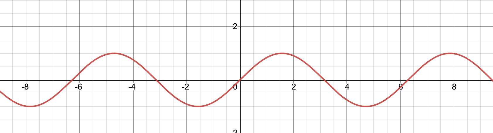
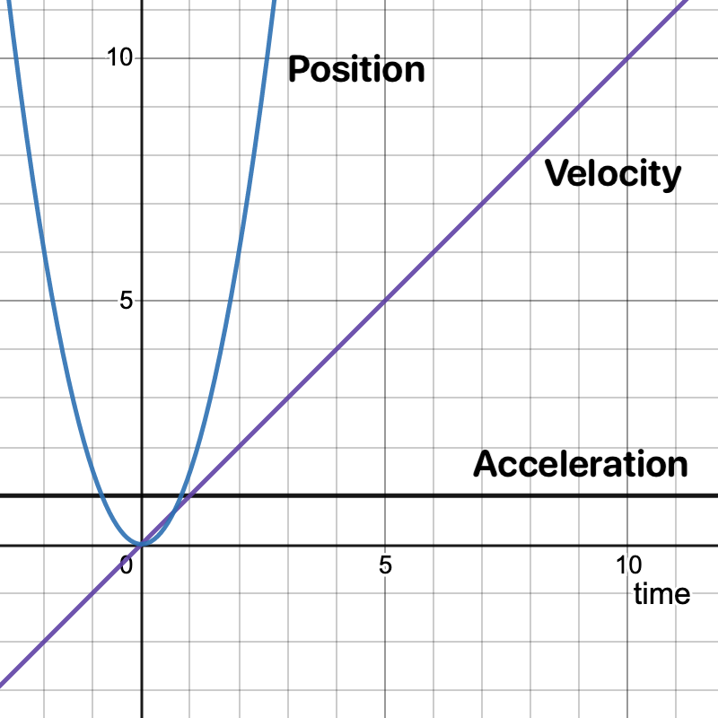
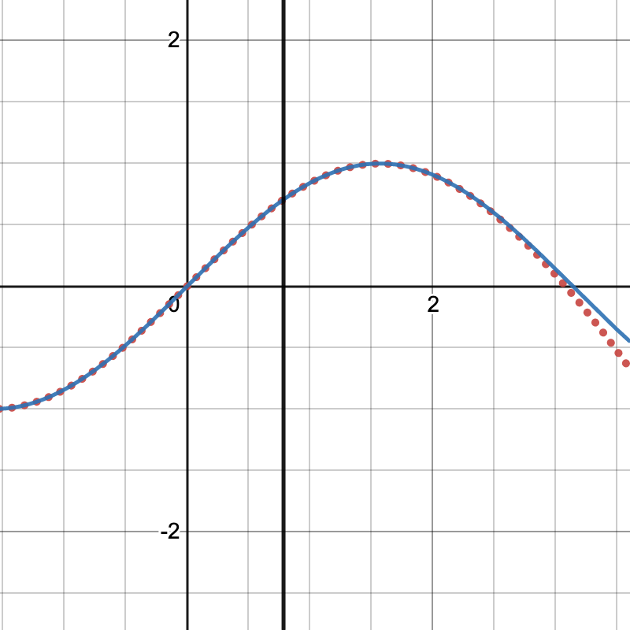

## Computers aren't infinite.

How can computers compute *(no pun intented)* infinite functions like sin so fast? Take video games for instance, that need to compute trig functions incredibly fast 100's of times a second to render frames. If sine and cosine took long at all, we would never have video games.

How do computers do it?

------

Historically computer scientists have two ways of getting around this problem. 

1. Store a table of sine and cosine values, then reference that table whenever you need. Java does this, and it works fairly well until you need a value of sine that isn't in the table
2. Estimate $$sin(x)$$ using another function.

Here I'll show you how computers estimate sin for any value.

## Sine and derivatives

#### Before we take a deeper dive into the math, there's two concepts we need to understand.

------

### Sine

For a little background I'll start by explaining two important concepts. First, $$sin(x)$$. You may remember this fun function from a high school algebra class. $$sin(x)$$ has these important properties. 

1. Sine is infinite, meaning it'll have a value at any number you put into it. 
2. It's also periodic, which means that it repeats itself over and over again (like a wave).

Here's a graph of *y=sin(x)*.



As you can see, the value of *sin(x)* goes up and down between $$-1$$ and $$1$$.

You can also tell that it's not coming to an end. It'll go on forever from −&infin; all the way to +&infin;.

#### One more important thing about sine is that the curve 0 to $$\frac{\pi}{2}$$ is repeated on the entire rest of sine. The curve might be backwards or upside down, but it's always exactly the same. 

#### That means if we can figure out values for any point in $$0$$ to $$\frac{\pi}{2}$$, we can figure out points for anywhere on sine.

------

### Derivatives

A derivative is the core concept of Calculus. Basically, when you take a derivative of a function, you create another function that measures the *rate of change* of the original function. It can be confusing, but a really good example of this comes from physics.

If we have a particle that's moving according to the position function

$$
x=vt+\frac{1}{2}at^2
$$

We can take the ***Derivative*** of that funciton, to get

$$
v=at
$$

***Velocity*** is the derivative of the position function. It's literally, *the change in position over time*. We can even take the derivative of Velocity to get

$$
a=\left(some\:number\right)
$$

***Acceleration***. Acceleration is *the change in velocity over time*.

Here's a graph of all these functions over time. You'll notice the velocity is going up at a constant rate *a*, and the position is going up exponentially. If we dropped a ball off a cliff. The ball would fall faster over time, so the velocity would steadily increase, but the acceleration would always be *$$9.81\frac{m}{s^2}$$*.



Finally, derivatives are shown using this syntax
$$
derivative\:of\:f\left(x\right)=f'\left(x\right)
$$
So from now on, if you see *f'(x)* that's the derivative of the function *f*. If we add more *'* to the function if grows in derivatives. So the second derivative of *f* is
$$
second\:derivative\:of\:f\left(x\right)=f''\left(x\right)second\:derivative\:of\:f\left(x\right)=f''\left(x\right)
$$

------


## How do we use derivatives to calculate sine?

### A: Taylor Series

Taylor series estimate a function. Basically, a mathemetician named Brook Taylor realized that any function is equal to this sum


$$
f\left(x\right)=f\left(0\right)+\frac{f'\left(0\right)}{1!}x+\frac{f''\left(0\right)}{2!}x^2+...
$$


Each part that we're adding up is the $$nth$$ derivative of *f* divided by the number *n!* it's at, times $$x^n$$. If we add up infinity of these functions, this Taylor series will be perfectly equal to $$f(x)$$. 

> Each time we add one of the parts above, we're adding a *degree* to the Taylor series. So the above function is to the 3rd degree.

Taylor series work on the idea that the function is related to it's derivatives somehow. So we can get the initial value of $$f(x)$$ at $$f(0)$$, and the next derivative $$f'(x)$$ gives us the direction it should go next. Each derivative we add in this way points the Taylor series in the correct direction more and more until it's exactly equal to the entire original function.

------

But, we don't always have to add up to infinity. In fact, the series is very close to $$f(x)$$ for a short bit after only a few sums of the Taylor series. 

This comes in handy if say, we only need to know values for a specific part of the function say *\*ahem\** 0 to $$\frac{\pi }{2}$$.

In fact, this is the Taylor series to the 7th degree, which happens to equal $$sin(x)$$ nearly exactly from $$0$$ to $$\frac{\pi }{2}$$.


$$
sin(x)=x-\frac{x^3}{3!}+\frac{x^5}{5!}-\frac{x^7}{7!}+\frac{x^{11}}{11!}-\frac{x^{13}}{13!}+\frac{x^{15}}{15!}
$$




The graph above shows that the Taylor series is equal to $$sin(x)$$ until $$\frac{\pi}{4}$$, where it starts to wander.

## Computer time!

Now we have a function we can use to estimate $$sin(x)$$ anywhere along $$sin(x)$$.

Since the function isn't infinite, we can translate it to a computer function very easily. Heres `sin(x)` in Swift.

```swift
let S1 = -1.66666666666666324348e-01;  // -1/(3!)
let S2 = 8.3333333332248946124e-03;    //  1/(5!)
let S3 = -1.98412698298579493134e-04;  // -1/(7!)
let S4 = 2.75573137070700676789e-06;   //  1/(9!)
let S5 = -2.50507602534068634195e-08;  // -1/(11!)
let S6 = 1.58969099521155010221e-10;   //  1/(13!)

func usersin(_ x: Double) -> Double {
  let z = x*x                          // x^2
  let v = z*x                          // x^3
  let r = S2+z*(S3+z*(S4+z*(S5+z*S6))) // Taylor function part 1/2
  return x+v*(S1+z*r)                   // Taylor function part 2/2
}
```

Here's how this works.

1. First, we're storing the larger numbers at the top. These numbers are constants, so we can set them statically outside the function.
2. The variables `z`, and `v` are placeholder variables for powers of `x`, they're there mostly for readability
3. `r` is the first part of the actual Taylor function. I found that if I kept the entire polynomial in one declaration it messed up the final result.
4. We return the final Taylor function.

To test this implementation, we can import `Foundation` and compare it to Swift's built-in `sin`.

```swift
#!/usr/bin/swift

import Foundation

let S1 = -1.66666666666666324348e-01;  // -1/(3!)
let S2 = 8.3333333332248946124e-03;    //  1/(5!)
let S3 = -1.98412698298579493134e-04;  // -1/(7!)
let S4 = 2.75573137070700676789e-06;   //  1/(9!)
let S5 = -2.50507602534068634195e-08;  // -1/(11!)
let S6 = 1.58969099521155010221e-10;   //  1/(13!)

func usersin(_ x: Double) -> Double {
  let z = x*x                          // x^2
  let v = z*x                          // x^3
  let r = S2+z*(S3+z*(S4+z*(S5+z*S6))) // Taylor function part 1/2
  return x+v*(S1+z*r)                   // Taylor function part 2/2
}

func printUserSin(_ input: Double, name: String) {
    print("x\t=\t\(name)")
    print("usersin(x):\t\(usersin(input))")
    print("sin(x):\t\t\(sin(input))")
    print("")
}
printUserSin(Double.pi/6, name: "Pi/6")
printUserSin(Double.pi/8, name: "Pi/8")
printUserSin(Double.pi/21, name: "Pi/21")
printUserSin(Double.pi/2, name: "Pi/2")
printUserSin(Double.pi/2 - 0.01, name: "Pi/2 - 0.01")
```

Which spits out:

```bash
x	=	Pi/6
usersin(x):	0.4999999999999961
sin(x):		0.49999999999999994

x	=	Pi/8
usersin(x):	0.38268343236508884
sin(x):		0.3826834323650898

x	=	Pi/21
usersin(x):	0.14904226617617444
sin(x):		0.14904226617617444

x	=	Pi/2
usersin(x):	1.000000000251294
sin(x):		1.0

x	=	Pi/2 - 0.01
usersin(x):	0.9999500006418387
sin(x):		0.9999500004166653
```

Which is **nearly** completely accurate for all the values we gave it, plenty close for any calculation we may need, and plenty fast as well!

## Conclusion

I've shown a very naive implementation of $$sin(x)$$. It doesn't take into account values outside of $$0$$ to $$\frac{\pi}{2}$$ and doesn't account for negative values. In fact, this is the bare minimum you would want from a `sin` function. 

In a future post I'll go over some of the tricks computer scientists have used to get around those problems, and compare speeds of this function with C and C++.

> If you'd like to run the code above on your own, create a file called `main.swift` and copy-paste the code into that file. Then run`chmod +x main.swift && ./main.swift` to run the script.
