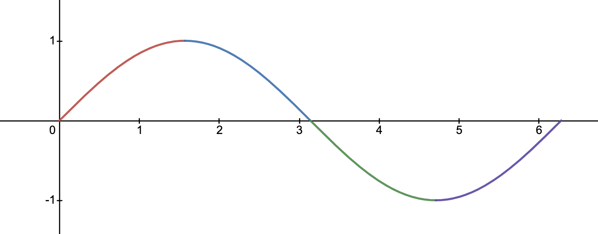
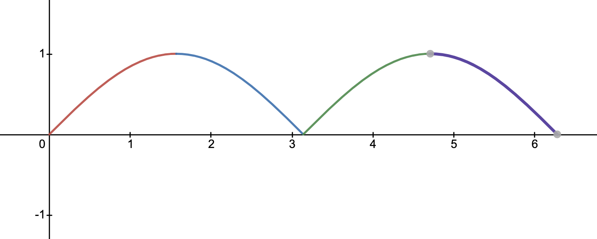
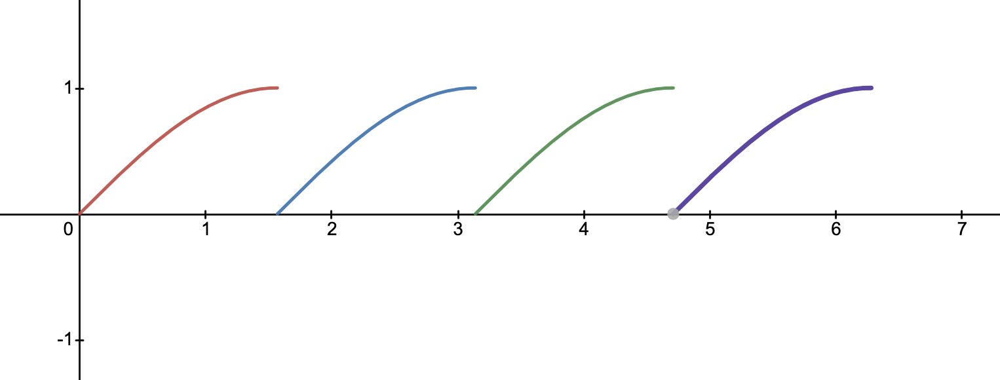

## Previously on...

In my last post, I used Taylor Series to come up with a function to estimate $$sin(x)$$ for any number between $$0$$ and $$\frac{\pi}{2}$$. While this is cool, it's rather useless. But, thankfully, I can use the numbers we can already to calculate any number of $$sin(x)$$.

> If you haven't read my previous post, it's a good read and will definitely make this post make much more sense. [You can read that post here](https://windchillblog.com/2021/03/17/How-Computers-Calculate-Sin.html).

## Sin Repeats

$$sin(x)$$ has an awesome property that I'm going to take complete advantage of for this implementation. **Sin is the exact same from $$0$$ to $$\frac{\pi}{2}$$ everywhere else on the number line.** All the rest of the numbers are flipped horizontally, or vertically, or both. 

It's easier to see this with the graph of $$sin(x)$$.


It's pretty easy if you can rotate your phone/laptop to see that the curve from $$0$$ to $$\frac{\pi}{2}$$ is the flipped horizontally between $$\frac{\pi}{2}$$ and $$\pi$$, then horizontally and vertically between $$\pi$$ and $$\frac{3\pi}{2}$$, and finally flipped vertially from $$\frac{3\pi}{2}$$ to $$2\pi$$.

## Flip Flops 🩴

Since we can already calculate all the numbers from $$0$$ to $$\frac{\pi}{2}$$ in $$sin$$, all we've gotta do is figure out some swift functions to flip flop around our existing results.

Here's what we're starting with, with each quadrant that we need to flip or flop in a different color.



1. Vertical Flips

It's pretty easy to flip a function vertically. In math it's called the *reflection* of a function. All we have to do is make the entire function negative and it'll be flipped vertically.


> Source: https://mathbitsnotebook.com/Algebra1/FunctionGraphs/FNGTransformationFunctions.html

The only areas we need to vertically flip $$sin(x)$$ are between $$\pi$$ and $$2\pi$$, where $$sin(x)$$ is negative.

After applying the vertical flops, our graph looks like this



2. Horizontal Flops

Now all we have to do is flop the blue and purple lines backwards. We can do this by just shifting the $$x$$ value $$\frac{\pi}{2}$$ to the left.

After the horizontal flop we end up with this graph.



Sweet! Now we can use these flip flops in our sin function in swift to calculate any value for $$sin(x)$$.

## Swift Flip Flops 🐥🩴

Now to implement these stylish shoes in Swift.

1. Vertical Flips

As said before, all we have to do to flip a function vertically is make sin negative. That's super easy in swift, so here's the vertical flip function.

```swift
sin(-input)
```

2. Horizontal Flops

All we need to do here is subtract $$\frac{\pi}{2}$$ from the `input` variable and we're good to go!

```swift
sin(input - (Double.pi/2))
```

## Finally...

Yay! Now all we have to do is

1. Reduce $$x$$ to be between $$0$$ and $$2\pi$$.
2. Flip flop our way to our result!

Here are the few rules that we'll need to follow to figure out which flip or flop to use.

1. If $$x$$ is between $$\pi$$ and $$2\pi$$, flip it <u>vertically</u>.
2. If $$x$$ is between $$\frac{\pi}{2}$$ and $$\pi$$ *or* $$\frac{3\pi}{2}$$ and $$2\pi$$, flip it <u>horizontally</u>. 

With these rules in mind, we almost have the swift code written for us! I'll just take those "If $$x$$ is..." and turn them into `if` statements.

Here's the final swift implementation of $$sin(x)$$.

```swift
let S1 = -1.66666666666666324348e-01;  // -1/(3!)
let S2 = 8.3333333332248946124e-03;    //  1/(5!)
let S3 = -1.98412698298579493134e-04;  // -1/(7!)
let S4 = 2.75573137070700676789e-06;   //  1/(9!)
let S5 = -2.50507602534068634195e-08;  // -1/(11!)
let S6 = 1.58969099521155010221e-10;   //  1/(13!)

func usersin(_ xOrig: Double) -> Double {
    // Reduce x to be between 0 and 2pi
    var x = xOrig.truncatingRemainder(dividingBy: 2 * Double.pi)
    
    // If it's between pi/2 => pi or 3pi/2 => 2pi. Flip it horizontally
    if (x > Double.pi/2 && x < Double.pi) || (x > (3*Double.pi)/2 && x < 2*Double.pi) {
        x = x - (Double.pi/2)
    }
    
    let z = x*x                          // x^2
    let v = z*x                          // x^3
    let r = S2+z*(S3+z*(S4+z*(S5+z*S6))) // Taylor function part 1/2
    
    // Flip the function if needed, eg between pi and 2pi
    if x > Double.pi && x < Double.pi * 2 {
        return -x+v*(S1+z*r)             // Taylor function part 2/2 (but negative)
    } else {
        // No need for vertical flip
        return x+v*(S1+z*r)             // Taylor function part 2/2
    }
}
```

## Benchmark

I decided to test the speed of this implementation, and the benchmarks look pretty good. For 1,000,000 $$sin(x)$$ operations, the results look like:

```
Time elapsed for User Sin: 0.7528519630432129 s.
Time elapsed for Normal Sin: 0.6716610193252563 s.
```

So not too far off between them. The code I used to benchmark is below.

```swift
#!/usr/bin/swift

import Foundation

... User sin defined up here ...

func printTimeElapsedWhenRunning(title: String, operation: (() -> Void)) {
    let startTime = CFAbsoluteTimeGetCurrent()
    operation()
    let timeElapsed = CFAbsoluteTimeGetCurrent() - startTime
    print("Time elapsed for \(title): \(timeElapsed) s.")
}

printTimeElapsedWhenRunning(title: "User Sin") {
    for i in 0..<1000000 {
        let _ = usersin(Double(i))
    }
}

printTimeElapsedWhenRunning(title: "Normal Sin") {
    for i in 0..<1000000 {
        let _ = sin(Double(i))
    }
}

```

> After running this code ~10 times the results were within 0.001s of each other, so the error from this test is negligible.

## Conclusion

While it's fun to figure out and define our own implementation of $$sin(x)$$, it's not super practical. Other programers have already figured out this math, and have figured out ways of making it slightly faster than my own. So, is it practical? No. But it was fun to do!

