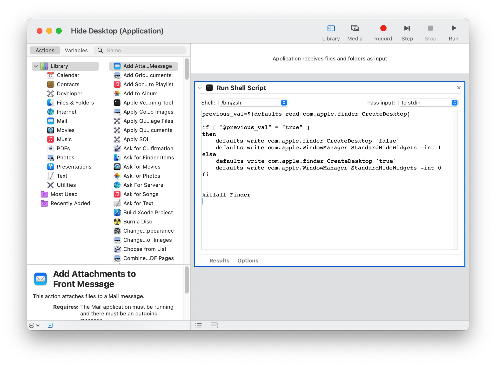
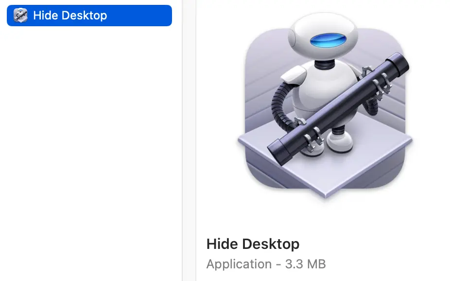

I often find myself needing to hide my desktop icons. Whether for a demo for [CodeEdit](https://codeedit.app), sharing my screen for work, or any other task that requires sharing my screen, I prefer to have my desktop contents hidden.

So here's a really simple Automator script to toggle your desktop. To show your desktop items again just run the script! Note: it kills Finder, so any finder panels you have open will be closed when this is run.

Throw this in a `Run Shell Script` action in a new automation:

```bash
previous_val=$(defaults read com.apple.finder CreateDesktop)

if [ "$previous_val" = "true" ]
then
	defaults write com.apple.finder CreateDesktop 'false'
	defaults write com.apple.WindowManager StandardHideWidgets -int 1
else
    defaults write com.apple.finder CreateDesktop 'true'
	defaults write com.apple.WindowManager StandardHideWidgets -int 0
fi


killall Finder
```



Then I like to export it to an application so I can run it easily from Spotlight



Demo Video:

<video controls width="90%" style="margin-bottom: 1.5em;">
    <source src="demo.mp4" type="video/mp4">
  Your browser does not support the video tag.
</video>
