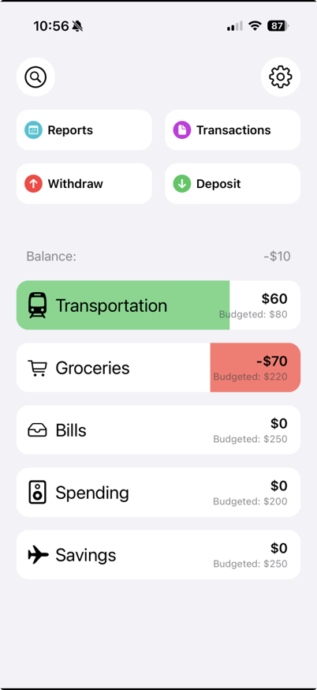
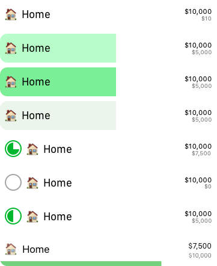
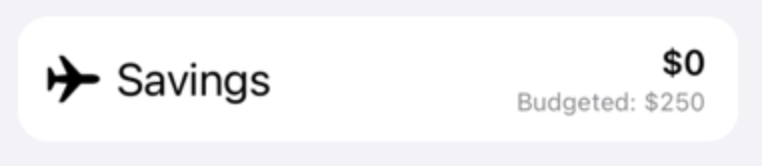
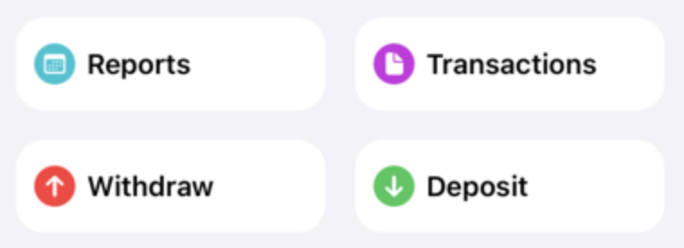
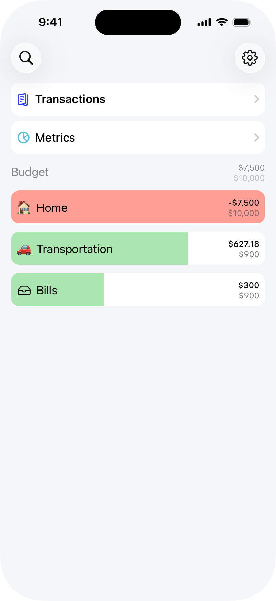
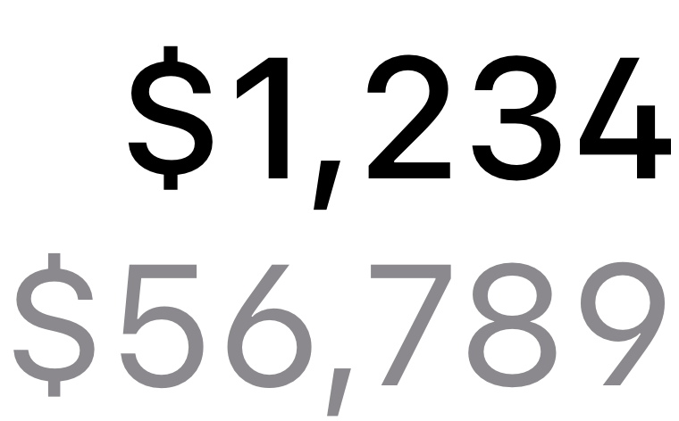
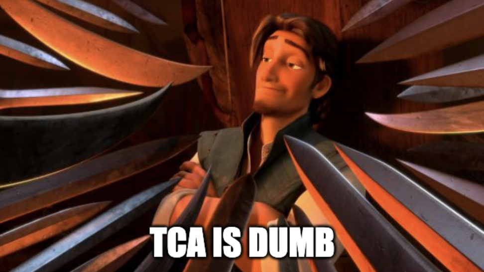

This is the first installment in what I'm hoping is a regular dev log for my rewrite of OpenBudget. My hope is to record my development process for an indie app in the modern software engineering age. I'll be trying to post regular installments, and my goal is to launch the version 2.0 of OpenBudget by the end of the year.

OpenBudget is my personal budgeting app that I developed while in high school. In recent years I've fallen short of my personal expectations for keeping it updated, and it's so far behind that I've decided it's due for a full rewrite. 

I've learned a lot about software engineering since first launching OpenBudget in November of 2020. I've had the opportunity to work on projects ranging from health care, to [IDEs](https://codeedit.app) with CodeEdit, to enterprise b2b software at PepsiCo. I'll be bringing this expertise to the table, but more importantly I'll be bringing a devotion to the craft, working view-by-view to develop a love letter to software.

## OpenBudget v1

Let's take a brief look at what OpenBudget v1 looks like on the App Store right now. The app revolves around the idea of 'envelope budgeting', with a small twist. In OpenBudget, you log where you spend by category. Each category has a set limit for how much you'd like to spend. Categories can range from transportation to food to spending money, or even a goal like saving for a vacation. You can add money to each category to log income.

Often users will use the category method as an estimate of how much they spend, rather than an exact cent-by-cent log of every purchase they make. As a young person learning how to manage my money, I used OpenBudget to establish what my budget should look like and monitor that I was successfully meeting my goals.

To achieve this, OpenBudget presents all categories on the home page with a small, colored, indicator bar indicating how much money is left in the category. Each category has a balance depending on the sum of all transactions in the category.

This design isn't bad. In fact, it landed a front page spot on the App Store. That being said, there's room for improvement.

## Where to start?

I decided to start with a few questions and work from there.

### What works well with this home design?

-   **Navigation**
    One of my favorite things about OpenBudget is the lack of a tab bar. It only has a few screens, but tab bars (imho) take up a lot of real estate for not a lot of benefit. I want my content front and center. For some apps like Apple Music, a tab bar *is* the content (with the now playing UI). In OpenBudget, the content is the categories (and other lists). Navigation is kept to the top in it's own area.
-   **Progress Bars**
    Each category has a progress bar. This makes it extremely easy to tell the spending status of each category in the budget. It's a good visual indicator and part of the core identity of OpenBudget. Other budgeting apps achieve this in other ways, such as a smaller 1-2px tall indicator or a round progress bar. 

I did a bit of experimenting with the progress bar design, but ended up deciding to keep the original full-cell idea, but adjusted the colors to help with text clarity. Here's some of the tossed ideas.

### What should change?

-   **Colors**
    In modern iOS apps we often find a more toned down colors pallet. For one, the greens and reds here are not great for 
    
-   **Repeated text**
    There's a lot of 'budgeted' thrown around here, we'll remove those extra labels.
    
-   **Large text**
    Some text here is too large, specifically the category names. Usually font sizes for lists are around 17pts, the v1 cells are much larger. We should have far more visual real estate by making those labels smaller. This also brings a little more consistency with system table cells.
    
    
-   **Navigation**
    While I am a huge fan of this navigation scheme, four buttons on the top does not work well with large accessibility text sizes. To fix this I'll be removing the 'Withdraw' and 'Deposit' buttons from this navigation area. I've been developing a new element that will replace these, which I'll go over in a future installment.
    

### What might we add?

-   **Glass**
    Liquid Glass is Apple's new design language. I'm hoping to have OpenBudget v2 ready to release around the time of the next OS release (November), so I'm planning on dropping support for OS versions lower than 26. What this means is I'll be going all-in on the glass design. On this screen, the Search and Settings buttons will be glassified.

-   **Budgeted amount**
    Something that's always bothered me is the lack of a place to see the *total* budgeted amount on the Home Screen. I'll be putting that in the header under to the *balance* label. I feel that this matches the rest of the category cells, so it keeps a similar design language.
    
-   **Negative Progress Bar Width**
    [Nels Parenteau](https://www.nelsparenteau.com) pointed out that if a category is negative, there's no point in indicating *how* negative it is, it should just indicate that there's an overspend. In v2, the red bar will cover the entire width of the category cell. This will reduce unnecessary information on the home view.

## New Design

I think that sums up everything I need to change on this. I've chosen a new color palette, with this nice green and red for the progress bars. I'm also going to be using non-system colors for the table background and selection colors.

| Name             | Old                      | New  |
| ---------------- | ------------------------ | ---- |
| Green            |  |  |
| Red              |  |  |
| Table Background |  |  |
| Selection        | N/A                      |  |

This pallet is much lighter. The green and reds of the progress bar allow text to be more readable on top of them. The lighter background color makes the content more of the focus, while subtly allowing shape to guide the user's eyes.

Combining all of this, we get a new Home Screen design.

I'm extremely happy with this. There's tons more visual space, the fonts are clearer, and there's more space for user's category names. On top of this, at larger accessibility text sizes the layout doesn't change very much. The fonts grow bigger, but for the most part we can keep the same layout even at those sizes.

One of the most fun things about this is that I did a lot of experimenting with fonts, specifically font modifiers and OpenType features ([which I wrote about here](https://khanwinter.com/2026-02-06-OpenType-UIFont/)). The result is this very nice, specialized, monetary, font for all currency labels in the app. It has more open characters, and emphasizes clarity even on small labels. There's a few other subtle typography improvements as well, such as the fact that the navigator cells now are slightly more bold than category cells, providing more visual distinction between the two.

The navigation is also changed. Due to the removal of the two unnecessary buttons, the remaining navigation cells can take up the full width of the screen. This is also very good for accessibility. For users who like larger text sizes, the labels grow perfectly, and don't require a layout change for the very large accessibility sizes.

## Technology Details

For the more technical among you readers, I've decided to forgo Apple's SwiftUI framework entirely. I've done a lot of work in it, and have made my best attempt at integrating it into my apps. That being said, I attempted this rewrite at the beginning of last fall (2025) and even with the improvements to the framework in that time I continually came across severe limitations.

Since my goal for this app is to be proud of every single screen, I'm aiming not just for 'it works' but for perfection. SwiftUI does not achieve that for me. It's buggy, behaviors change between releases, and there are limitations to the framework that Apple's walls do not allow developers to work around. One good example of this is drag and drop. I'll write more on that topic later.

I'll be using UIKit and AppKit for the entire app. So far, it's payed out extremely well. By first starting with a design in [Sketch](https://www.sketch.com/), and moving on to the implementation with a plan for how it'll work with AutoLayout, I've removed my overhead time of messing around in SwiftUI previews nearly entirely. It's also helped me fully invest in an architectural framework based on [Simon B. Støvring](https://simonbs.dev/)'s talk: [Achieving Loose Coupling with Pure Dependency Injection](https://www.youtube.com/watch?v=bmIW1skJQFo). I *highly* recommend checking out their talk on it.

I don't use any architecture frameworks.

Might be a hot take, but...

## What's Next?

That's all I have for this installment of the OpenBudget dev log. A lot of the topics in this are very foundational to the rest of the redesign. The new color palette, fonts, and use of space are most of what I'll be changing throughout the app, as well as some other improvement to cross-device sync and system integration improvements and reworks. I'm pumped that this is working out and I'm excited to keep sharing how things are going! Stay tuned in by following me on [Bluesky](https://bsky.app/profile/khanwinter.com) or subscribing to this sites' [RSS](https://khanwinter.com/feed.rss) feed!

