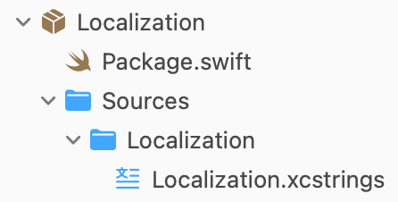

Xcode has a nice feature that generates Swift symbols for translation keys in a JSON file, with a nice little gui for editing the file. Xcode calls this file an `.xcstrings` resource, but really underneath it's just JSON. What this means is developers can get compile-time errors for using translation keys that don't exist in their resource files. Nice!

## The Problem

You might think to share your localizations resource with all your feature packages. That way you don't duplicate translation keys for strings shared across your app. You might make a nice little `Localization` package for it like so.



You'd quickly find the glaring issue with the generated symbols, they are only available in the module the file lives in. In this case, if we import `Localization` into our `HomePage` package, we don't get anything. Xcode also doesn't have a way to modify the symbol generation, so we have to do something ourselves.

The solution is to do our own symbol generation. Since the `xcstrings` file is just a JSON file under the hood, we can parse it easily. We can just take each key in the JSON file and convert it to a Swift extension.

If we have a `Hello World` key in our `.xcstrings` file, we'll generate a public `.l10n` enum with a `helloWorld` member like so.

```swift
public extension LocalizedStringResource {
	enum l10n {
 		public static var helloWorld: LocalizedStringResource { .Localization.helloWorld }
	}
}
```

This extension lives on `LocalizedStringResource` so it's explicit what's being accessed here. We could make this so it returns a `String`, but numerous SwiftUI and UIKit APIs take `LocalizedStringResource` and update themselves automatically by default so I've found this is more useful. 

To get a real string out of it, use it like so.

```swift
String(localized: .l10n.helloWorld)
```

Nice and simple!

## The Script

Previously, I was using [@danielsaidi.com](https://danielsaidi.com)'s [SwiftPackageScripts](https://github.com/danielsaidi/SwiftPackageScripts) to achieve this. It was a great starting point, but I found I had to modify the script heavily to make it work. On top of that, the time it takes to build and run a Swift executable for this is way too much for what it's doing. So, I wrote my own bash script that does the entire thing.

I also added a nice little debug feature. The generated enum is `@dynamicMemberLookup`, meaning you can access keys that don't exist. The lookup is debug-only, and logs a warning to the console when accessed. I found this really helpful while building out features, since I didn't have to go back into the localization file every time I found a new string to add. It still benefits from compile-time errors for missing strings though, so it'll still catch all your missing strings when you build for release!

If you want to use it, feel free to copy it from here. It's MIT licensed and doesn't feel like it needs version control so just copy it into your own `.l10n.sh` file and point it at your `.xcstrings` resource.

**Man page**

```sh
Usage: ./l10n.sh <input.xcstrings> <output.swift>

Generate a `LocalizedStringResource` extension for localization keys.
```

**Script contents**

```sh
#!/bin/bash

# MIT License
#
# Copyright (c) 2026 Khan Winter
#
# Permission is hereby granted, free of charge, to any person obtaining a copy
# of this software and associated documentation files (the "Software"), to deal
# in the Software without restriction, including without limitation the rights
# to use, copy, modify, merge, publish, distribute, sublicense, and/or sell
# copies of the Software, and to permit persons to whom the Software is
# furnished to do so, subject to the following conditions:
#
# The above copyright notice and this permission notice shall be included in all
# copies or substantial portions of the Software.
#
# THE SOFTWARE IS PROVIDED "AS IS", WITHOUT WARRANTY OF ANY KIND, EXPRESS OR
# IMPLIED, INCLUDING BUT NOT LIMITED TO THE WARRANTIES OF MERCHANTABILITY,
# FITNESS FOR A PARTICULAR PURPOSE AND NONINFRINGEMENT. IN NO EVENT SHALL THE
# AUTHORS OR COPYRIGHT HOLDERS BE LIABLE FOR ANY CLAIM, DAMAGES OR OTHER
# LIABILITY, WHETHER IN AN ACTION OF CONTRACT, TORT OR OTHERWISE, ARISING FROM,
# OUT OF OR IN CONNECTION WITH THE SOFTWARE OR THE USE OR OTHER DEALINGS IN THE
# SOFTWARE.

set -euo pipefail

IN_FILE="${1:-}"
OUT_FILE="${2:-}"

if [[ -z "$IN_FILE" || -z "$OUT_FILE" ]]; then
    cat << EOF
Usage: $0 <input.xcstrings> <output.swift>

Generate a \`LocalizedStringResource\` extension for localization keys.
EOF
    exit 1
fi

if [[ ! -f "$IN_FILE" ]]; then
    echo "Error: File not found: $IN_FILE"
    exit 1
fi

INPUT_FILENAME="$(basename "$IN_FILE")"
INPUT_STEM="${INPUT_FILENAME%.*}"

to_camel_case() {
  echo "$1" | awk '{
    result = ""
    n = split($0, words, /[ _\-]+/)
    for (i = 1; i <= n; i++) {
      word = words[i]
      if (length(word) == 0) continue
      if (i == 1) {
        result = result tolower(substr(word,1,1)) substr(word,2)
      } else {
        result = result toupper(substr(word,1,1)) substr(word,2)
      }
    }
    print result
  }'
}

KEYS=()
while IFS= read -r key; do
	KEYS+=("$key")
done < <(jq -r '.strings | keys[]' "$IN_FILE")

if [[ ${#KEYS[@]} -eq 0 ]]; then
	echo "Error: No keys found under .strings in $IN_FILE"
	exit 1
fi

{
    cat << EOF
import Foundation
import OSLog

// THIS IS A GENERATED FILE DO NOT MODIFY DIRECTLY

public extension LocalizedStringResource {

#if DEBUG
    @dynamicMemberLookup
#endif
    enum l10n {
#if DEBUG
        public static subscript(dynamicMember member: String) -> LocalizedStringResource {
            guard let match = Mirror(reflecting: l10n.self)
                .children
                .first(where: { \$0.label == member }),
                  let resource = match.value as? LocalizedStringResource
            else {
                Logger(subsystem: Bundle.main.bundleIdentifier ?? "", category: "l10n")
                    .warning("Missing localization key used: \"\(member)\"")
                return LocalizedStringResource(stringLiteral: member)
            }
            return resource
        }
#endif

EOF
    for key in "${KEYS[@]}"; do
        camel=$(to_camel_case "$key")
        echo "        public static var ${camel}: LocalizedStringResource { .${INPUT_STEM}.${camel} }"
    done
    echo "    }"
    echo "}"
} > "$OUT_FILE"

echo "Wrote to $OUT_FILE"
```


