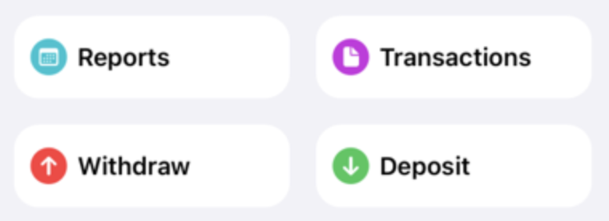
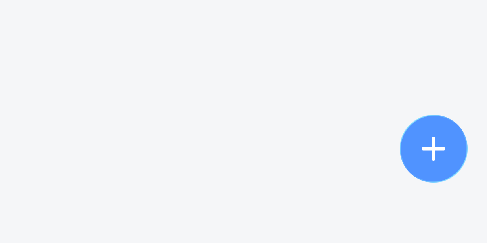

>   Welcome to the second part of my dev log on my journey rebuilding my personal budgeting app, [OpenBudget](https://openbudget.us). This is part 2, [read part one here](https://khanwinter.com/2026-03-09-OpenBudget-DevLog-01/)!

OpenBudget v1 struggled with screen space. This was pronounced in the home navigation section, where a grid of buttons became cramped, and didn't allow for any flexibility for adding new items. It was also extraordinarily bad for accessibility, as larger text sizes had zero room to grow.

 

Originally, I wanted to create a more compact version of Apple's Reminders app's navigation. I dislike tab bars in general, and absolutely love simpler navigation schemes. The mistake I made in v1 was combining both navigation and an *action* by including the Withdraw and Deposit buttons.

The first half of the fix is to redesign the navigation, which I went over in the first part of this dev log. The second half, was to take a look at how I was asking my users to create new items in the app. Turns out, there was a scattering of things. The two navigation buttons to create a new transaction, a button in settings to create a category, and another button to create a group.

These create actions are contextual. An interface should never ask a user to navigate away from their current screen to create something *for that screen*, which is exactly what I was asking users to do here. To solve this problem, I decided to consolidate all the 'create' actions into a single location, that I call the Action Button.

New in OpenBudget v2 is an omni-present Action Button that lives on the bottom corner of the screen. This button can be tapped or dragged into any screen, where the UI will react depending on its content. The Action Button lives above all content, ensuring users can always reach for it wherever they are.

When tapped, the button bounces and reacts to the user's touch. It's interruptible, so a user can catch it as it moves. It even has some subtle haptics to complete the experience.

<iphone-video src="./assets/new-transaction.mov" />

The button's action is dynamic. If there's more than one possible action, it morphs into a menu. When dismissed, the button morphs back into a circle.

<iphone-video src="./assets/show-menu.mov" />

In the Home Screen, dragging the button into the category list creates a new category. In the category detail, dragging the button creates a new transaction. Because the user is dragging with intent, the app infers what action they want to take.

<iphone-video src="./assets/new-category.mov" />

My intent is to create an interface that always feels *malleable*. This button is tappable, but it looks and feels like a small drop of liquid you can move around. When you *do* move it around, it responds. It drops into a new slot in the list you're working with, and drops with a little haptic *tap*. As the button is drug around it morphs like a liquid, stretching as you fling it quickly towards its destination.

<iphone-video src="./assets/morph.mov" speed="0.5" />

I mentioned on [Bluesky](https://bsky.app/profile/khanwinter.com/post/3mu6kqspjrk2u), but I'm going to blow by my self-imposed due date for this version 2. I've been head down hard at work getting this done, so I haven't shared much which makes me sad. I'm going to be slowing down a bit, and sharing more as I go along. I'm behind on this dev log, so expect a few more logs in quick succession as I catch up. I'd say right now I'm very nearly feature complete with v1. I've got a few things left to do in terms of migrating data from v1, and ensuring all of OpenBudget Cloud is ready to go. I've also got *tons* of cool stuff to share about OpenBudget Cloud. 

You can always follow along by following me on [Bluesky](https://bsky.app/profile/khanwinter.com) or subscribing to this sites' [RSS](https://khanwinter.com/feed.rss) feed.