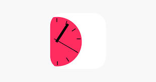

# OpenBudget

OpenBudget is a budgeting app for regular people. I've been budgeting for years, and hated most budgeting app's UI's and controls. Each one I tried felt clanky and didn't feel like they cared about the user experience at all. So I set our to make OpenBudget a budgeting app that is simple, intuitive and easy to use.

Now OpenBudget is available on the App Store for free, and was recently featured on Indie App Santa. It's a budgeting app allowing users to categorize their money and save easier and better. 

# Fueling Timer

[FuelingTimer](https://apps.apple.com/us/app/fueling-timer/id1453121223) has held a top 100 spot in Utilities on the iOS app store with over 2,000 monthly users. It's a simple diet-timer app for people who follow the Optavia diet. Optavia requires you to eat 4 or 5 times a day, and sometimes it's hard to remember to eat at all those times, so I made an app that sends reminders throughout the day at specified intervals to help remind people.

